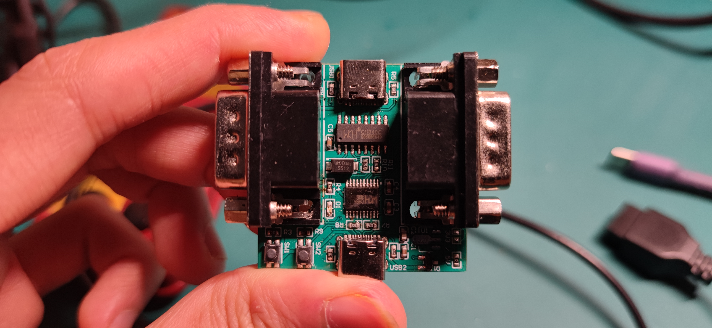
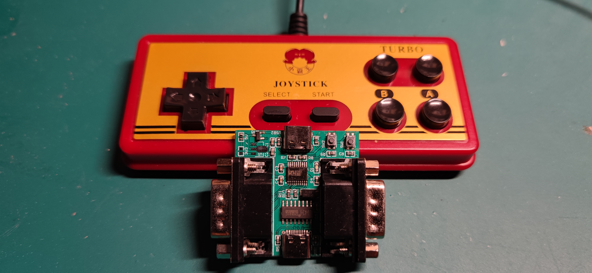

# [XBW] 一个基于CH552T的USB手柄转换器
> 
> 用这个小工具就可以把9孔的游戏手柄协议转换为USB HID Game Controller
> 经过测试，可以在windows上使用，Android手机上支持OTG的话，也应该没有问题
>
> 总之是个比较有意思的小项目，现在也开源出来吧

## 演示视频

成品

板载支持一路串口和一路USB Device，CH552T支持USB烧录，无需要断电（板载PMOS开关管）

PC测试使用的是VirtuNes模拟器
Android测试使用的NES模拟器为nes-emu，放在Tools目录了

> * [https://https://www.bilibili.com/video/BV143411575t/](https://www.bilibili.com/video/BV143411575t/)

祝大家玩得愉快！

## 固件编译说明
这里使用的是Keil进行编译，后续再考虑换SDCC，如果有空的话

## 感谢
> * [4NES4SNES](https://github.com/ishiyakazuo/CH551-4NES4SNES)

## 支持
如果你觉得这个项目有点意思，欢迎打赏一杯奶茶，给媳妇喝。
    
